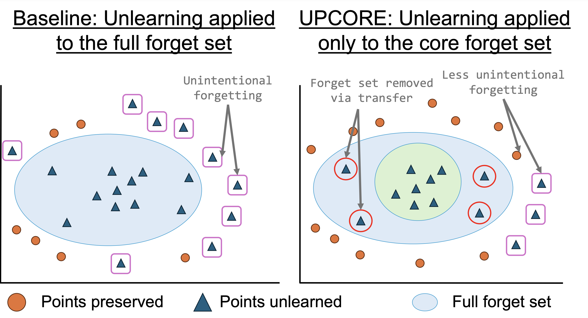

# UPCORE: Utility-Preserving Coreset Selection for Balanced Unlearning

This repository contains the code and data for the paper

[**UPCORE: Utility-Preserving Coreset Selection for Balanced Unlearning**]()

[Vaidehi Patil](https://vaidehi99.github.io/),  [Elias Stengel-Eskin](https://esteng.github.io/) and [Mohit Bansal](https://www.cs.unc.edu/~mbansal/)

## Overview

Unlearning is an essential technique for ensuring that machine learning models adhere to data privacy regulations (e.g., GDPR, CCPA) and ethical AI practices. However, existing unlearning methods often result in **unintended forgetting** and **degradation of model performance**. UPCORE (Utility-Preserving Coreset Selection) addresses this issue by selectively pruning high-variance outliers from the forget set, ensuring a better balance between **deletion effectiveness** and **model utility retention**.

### Key Features:
- **Less Collateral Damage**: Reduces unintended forgetting by removing outlier points from the forget set.
- **Positive Transfer**: Pruned points still get forgotten, minimizing damage while maintaining forget performance.
- **Method-Agnostic**: UPCORE can be applied to any unlearning framework.
- **Evaluating Unlearning**: Introduces AUC-based metrics to evaluate the trade-off between deletion and utility over time.



# **UPCORE: Utility-Preserving Coreset Design for Unlearning**  

UPCORE is built on top of [tofu](https://github.com/locuslab/tofu) and [NPO](https://github.com/licong-lin/negative-preference-optimization). It provides methods for effective unlearning in large language models while balancing accuracy and utility.

---

## **📁 Table of Contents**  
- [Installation](#installation)  
- [Dependencies](#dependencies)  
- [Datasets](#datasets)  
- [Usage](#usage)  
  - [Extracting the Core Forget Set](#extracting-the-core-forget-set)  
  - [Gradient Ascent & Refusal with Counterfact Topics](#gradient-ascent--refusal-with-counterfact-topics)  
  - [Negative Preference Optimization (NPO) with Counterfact Topics](#negative-preference-optimization-npo-with-counterfact-topics)  
  - [Gradient Ascent with TriviaQA Topics](#gradient-ascent-with-triviaqa-topics)  
- [Results](#results)  
- [License](#license)  

---

## **🛠 Installation**  

To set up UPCORE, follow these steps:  

```bash
git clone https://github.com/Vaidehi99/UPCORE.git
cd UPCORE
conda create -n upcore python=3.10
conda activate upcore
pip install -r requirements.txt
pip install flash-attn --no-build-isolation
```

---

## **📦 Dependencies**  

Ensure that all required dependencies are installed using:  

```bash
pip install -r requirements.txt
pip install flash-attn --no-build-isolation
```

---

## **📊 Datasets**  

UPCORE supports unlearning on the following datasets:  

- **Counterfact Topics:**  
  ```bash
  data/Counterfact_topics/
  ```
- **TriviaQA Topics:**  
  ```bash
  data/TriviaQA_topics/
  ```

---

## **🚀 Usage**  

### **Extracting the Core Forget Set**  
To extract the **core forget set** from a given complete forget set, run:  

```bash
python3 scripts/upcore.py
```

---

### **Gradient Ascent & Refusal with Counterfact Topics**  

#### **Training**  
To unlearn using **Gradient Ascent**, set `forget_loss = switch_unlearn` in `tofu/bash_config.conf`.  

To unlearn using **Refusal**, set `forget_loss = switch_idk` in `tofu/bash_config.conf`.  

Run training:  
```bash
cd tofu
./loop_run_split_train.sh
```

#### **Evaluation**  
```bash
cd tofu
./loop_run_split_eval.sh
```

#### **Compute AUC**  
```bash
python3 scripts/gather_results.py
python3 scripts/auc.py
```

---

### **Negative Preference Optimization (NPO) with Counterfact Topics**  

#### **Training**  
To train using **NPO**, run:  
```bash
cd negative-preference-optimization/TOFU
./loop_run_split_train_npo.sh
```

#### **Evaluation**  
```bash
cd negative-preference-optimization/TOFU
./loop_run_split_eval_npo.sh
```

#### **Compute AUC**  
```bash
python3 scripts/gather_results.py
python3 scripts/auc.py
```

---

### **Gradient Ascent with TriviaQA Topics**  

#### **Training**  
```bash
cd tofu
./loop_run_split_train_longform.sh
```

#### **Evaluation**  
```bash
cd tofu
./loop_run_split_eval_longform.sh
```

#### **Compute AUC**  
```bash
python3 scripts/gather_results.py
python3 scripts/auc.py
```

---

## **📈 Results**  

Results can be obtained using:  

```bash
python3 scripts/gather_results.py
python3 scripts/auc.py
```

---

## **📜 License**  
This project is licensed under **[MIT License](LICENSE)**.

---

## **📖 Citation**  

If you find this work useful, please cite:  

```bibtex

}
```
---
